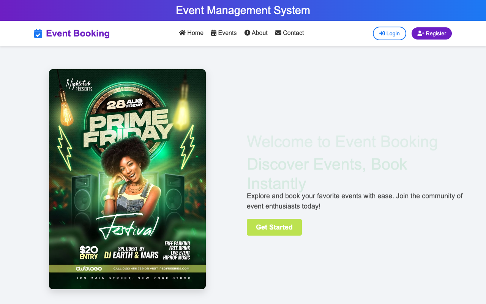
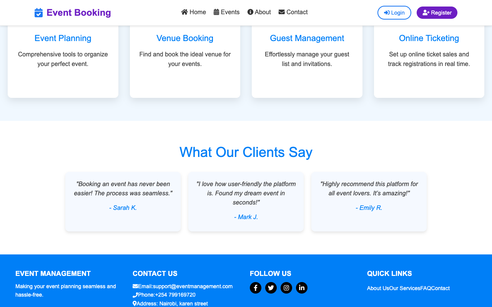
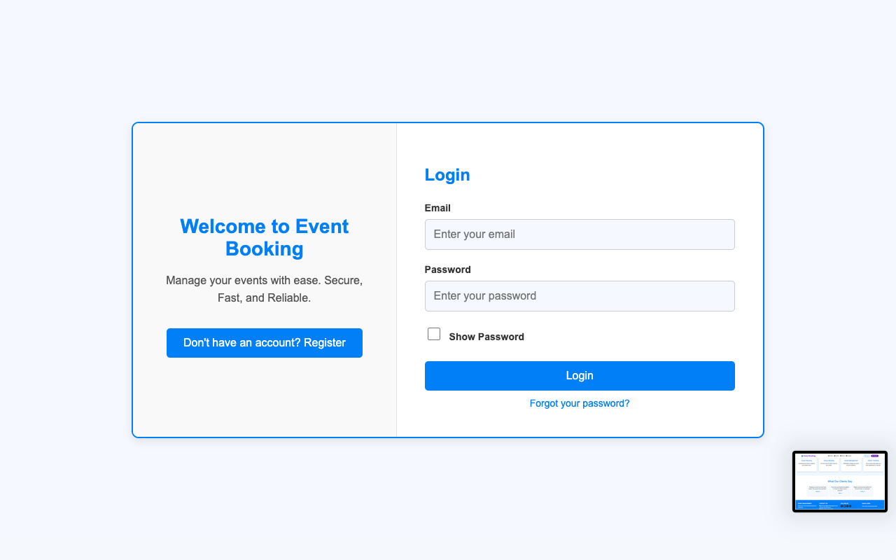
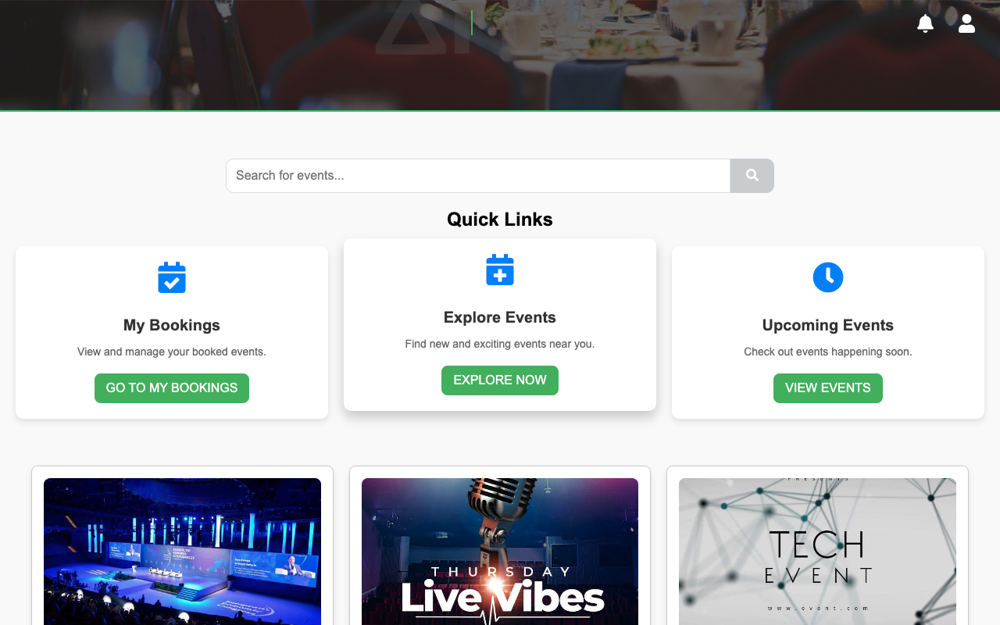
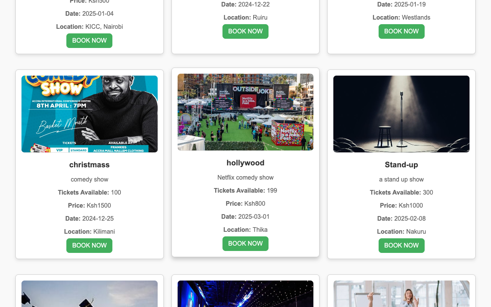
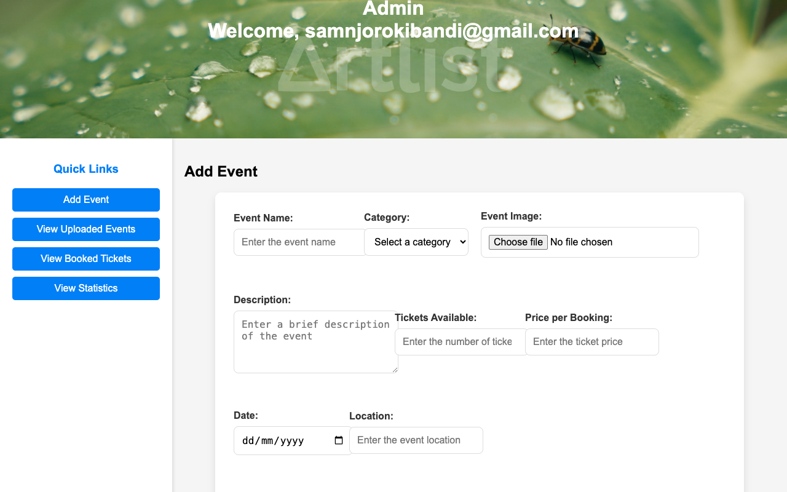
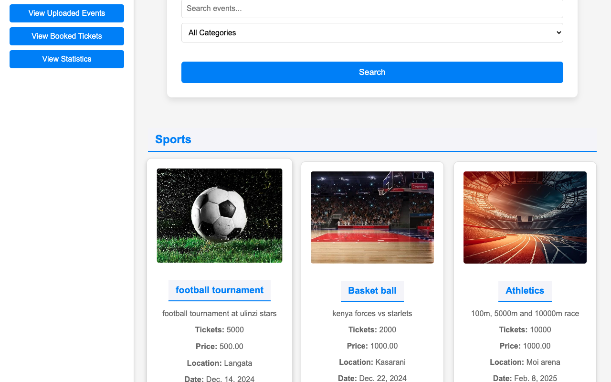
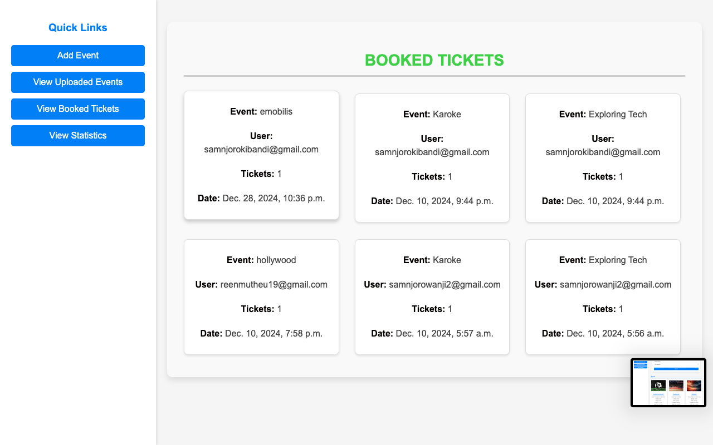
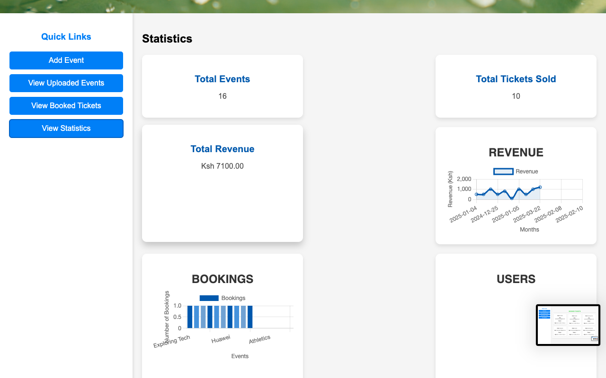

# Event management System


***
## 🧭 Table of Contents
1. [About The Project](#about-the-project)  
2. [Features](#features)  
3. [Built With](#built-with)  
4. [Getting Started](#getting-started)  
   - [Prerequisites](#prerequisites)  
   - [Installation](#installation)  
5. [Usage](#usage)  
6. [Screenshots / Demo](#screenshots--demo)  
7. [Contributing](#contributing)  
8. [License](#license)  
9. [Contact](#contact)  
10. [Acknowledgements](#acknowledgements)

---

## 📝 About The Project
A full-stack Event Management System enabling:

- Event creation, listing, and categorization  
- User registration and authentication  
- Admin dashboard for managing events and participants  
- (Optionally) QR code-based check-in, payment integration, notifications, etc.

Tailored to simplify event organization and streamline attendee management.

---


## ```Features```

- **User Authentication**  
  `Register, login, and profile management`
- **Event Management**  
  `Create/update/delete events with rich details`
- **Automated Emailing**
  `an email verification once you register`
- **Ticket System**  
  `Multiple ticket types with pricing tiers`
- **Search & Filters**  
  `Find events by date/location/category`
- **Admin panel**
  `login, create, manage, view ticket booked for the  events`

***
## 🛠️ Built With
- **Back-end**: Django framework 
- **Front-end**: HTML5, CSS3, javascript
- **Database**: MySQL / SQLite  
- **Optional**: JavaScript, AJAX
---

# Getting Started

### Requirements
 
 - **Python 3.7+**
 - **Django 3.2+**
 - **MySQL**
 - **XAMPP Server**


### ```Installation```

1. **create a new folder and navigate to the folder**
```bash
  cd to-your-folder
```
2. **clone the repository and navigate**
```bash
git clone https://github.com/samnjoro30/Event_management.git
cd Event_management
```
3. **Install dependencies**
```bash
pip install -r requirements.txt
```
4. **Set up enviroment variables**
```bash
touch .env
```
5. **Run migrations**
```bash
python manage.py migrate
```

- Now start your XAMPP serve to connect MySQL

6. **Run this command to run development server**
```bash
python manage.py runserver
```

## 🎯 Usage
1. Visit `http://localhost:8000/`  
2. Create an account  
3. Browse existing events or create a new one (admin only)  
4. Book for events (users)  
5. Admins can view participants and manage events

## 📸 Screenshots / Demo
<div align="center">
  
  
  <br>
  
  
  <br>
  
  
  <br>
  
  
  
</div>
# Contact
For any question or Support, please Contact:
 - Samuel Njoroge
 - **samnjorokibandi@gmail.com**